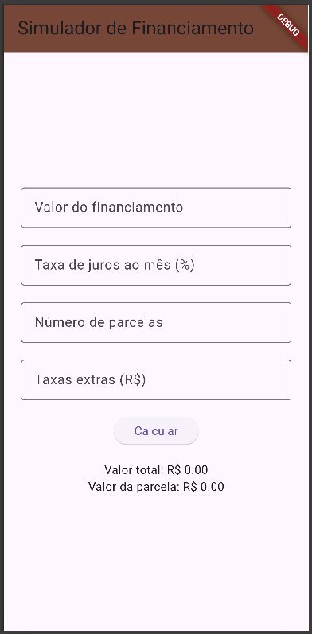
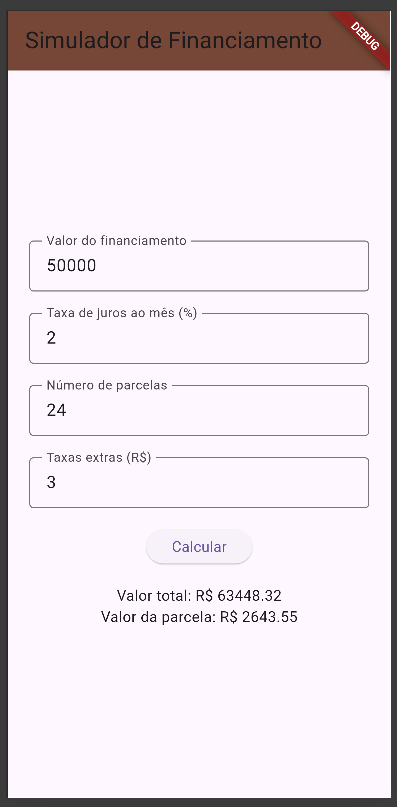

# Calculadora de Financiamento

Projeto basico aprendendo flutter, calculadora de financiamento.

#Prints

## Tecnologias
- Flutter
- VsCode
- Android Studio

# Passo a passo
- Clone este repositorio
- Abra com VsCode
- Em um terminal digite
bash
flutter pub get
flutter run